## Goodtimes Dashboard for one-stop planning

Goodtimes aims to be a one-stop social planner. The dashboard allows users to plan a hangout around an event in a specific location which includes 10 recommended restaurants for that destination so planning is simplified. Local weather data for the current day is helpful in reminding users on what is the most weather-appropriate attire. Goodtimes uses Eventbrite, Foursquare, and Darksky APIs.

## Parts of the user flow:

* Search form
* Eventbrite section
* Foursquare section
* Weather section
* Bucket list overview section
* Lightboxes with event/place information (for next version)
* Clicking on event and place opts to visit Foursquare/Eventbrite page

## User Stories:
* As a user, I want to be able to find a place or event to visit so that I can make reservations or attend.
* As a user, I should be able to narrow my search so I can decide on a specific experience, date range, and location
* As a user, I should be aware of the weather so I can dress for the occasion at the place or event.
* As a user, I should be able to add what I've planned in my planner/todo list so that I can see where I'm going to go, where I've been, where I desire to go and when they occur.
* As a user, I should be able to edit and delete what I added in my planner/todo list so that I can keep my list relevant. (for next version)
* As a user, I should be able to get a summary of the event or place so that I can make a better decision if the event or place is of interest and is achievable. (for next version)
* As a user, I should be able to go to the homepage on either Eventbrite or Foursquare for the particular selection so that I can get more details.
* As a user, I should be able to tab and select events or places with a keyboard so that I feel the website is accessible to me.

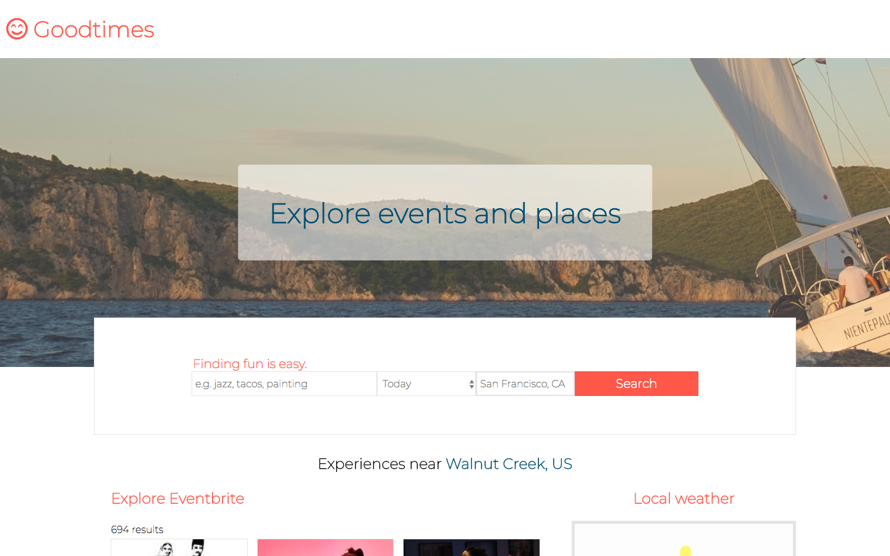
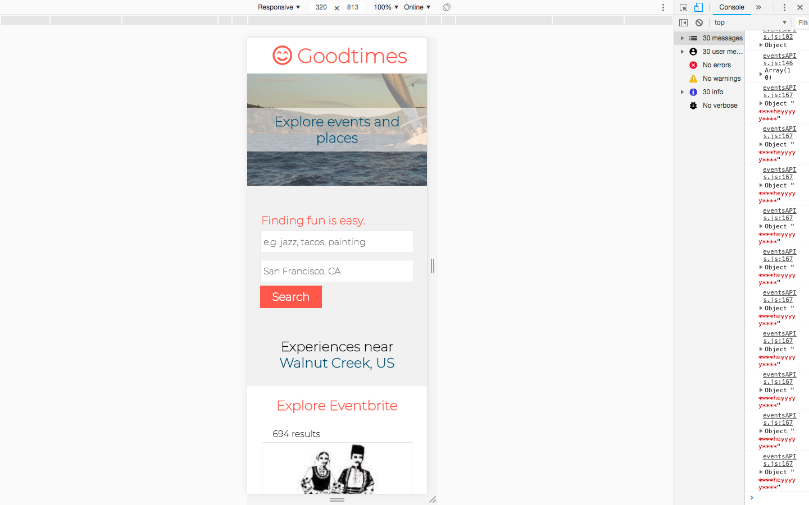
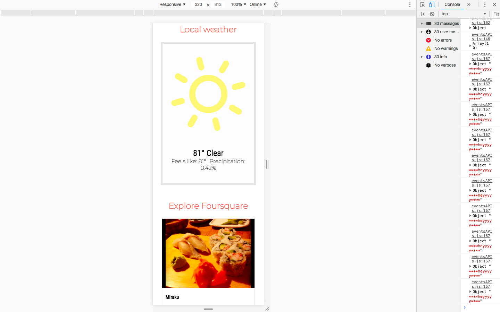
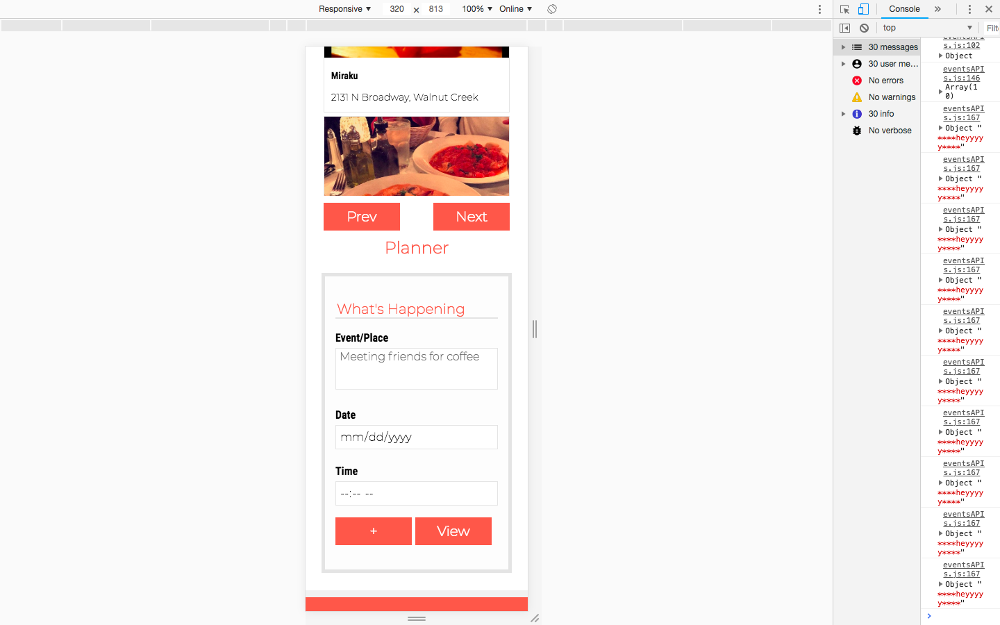
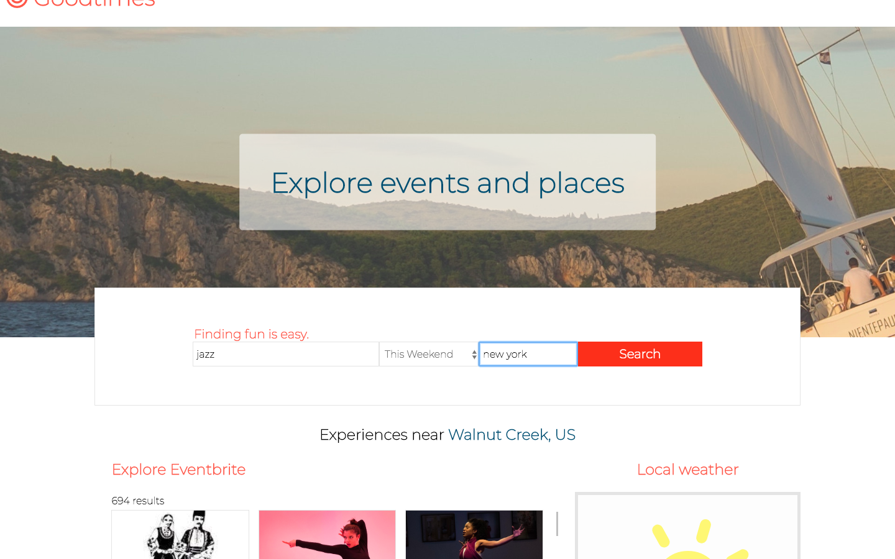
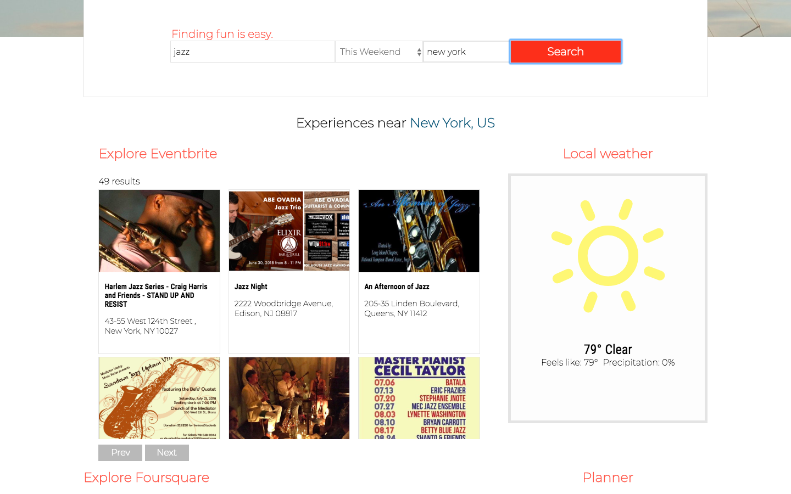
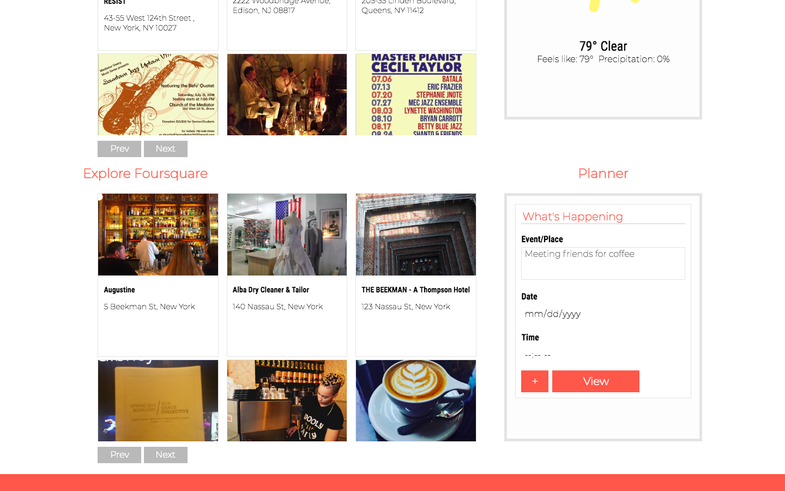
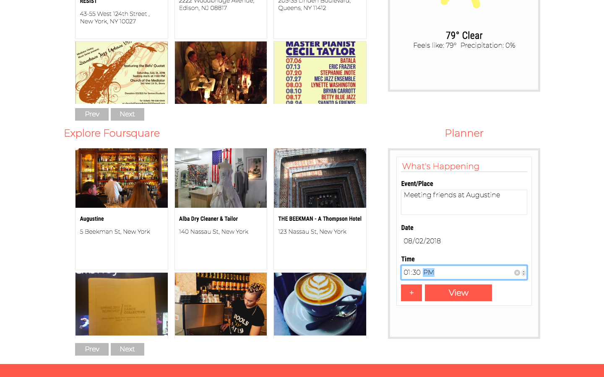
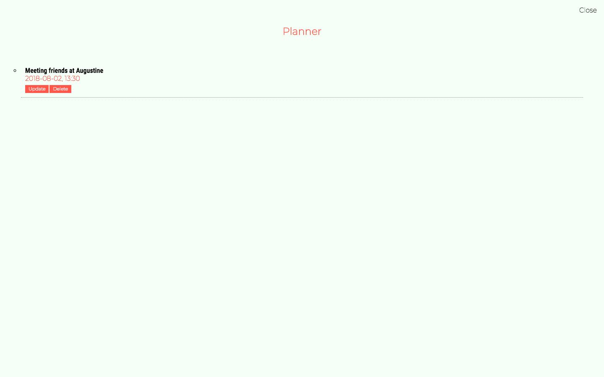
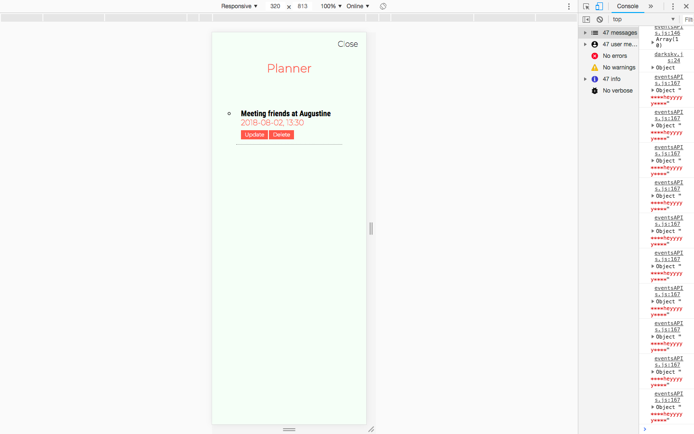
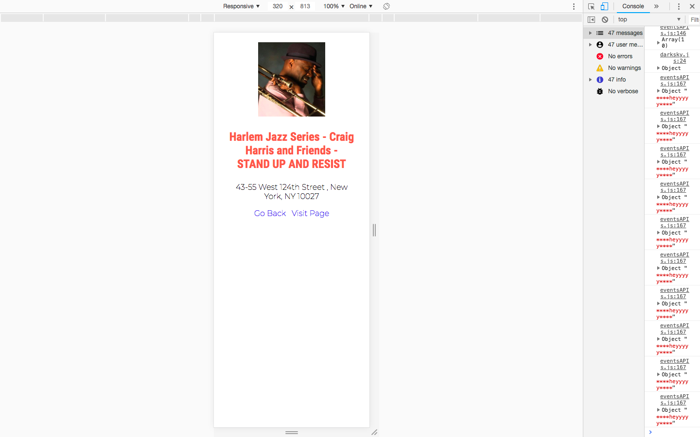
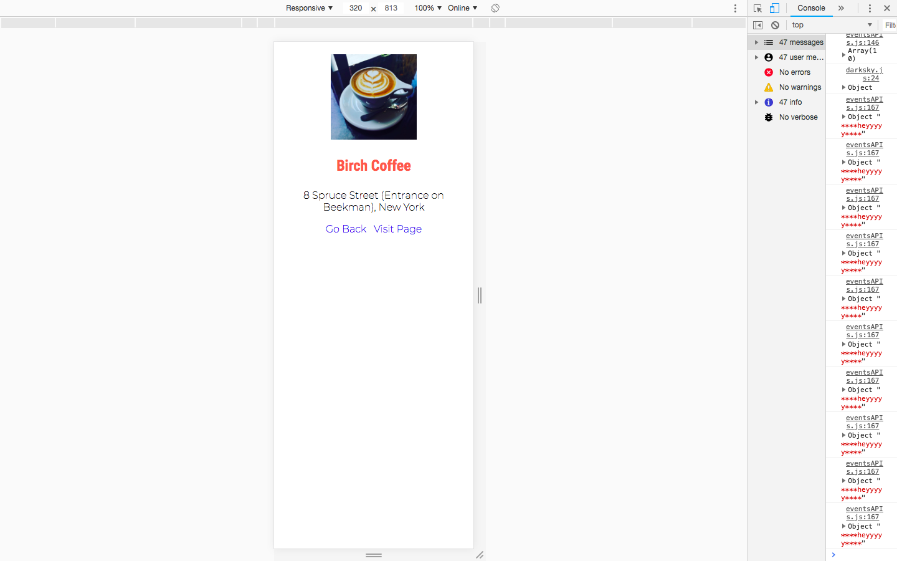
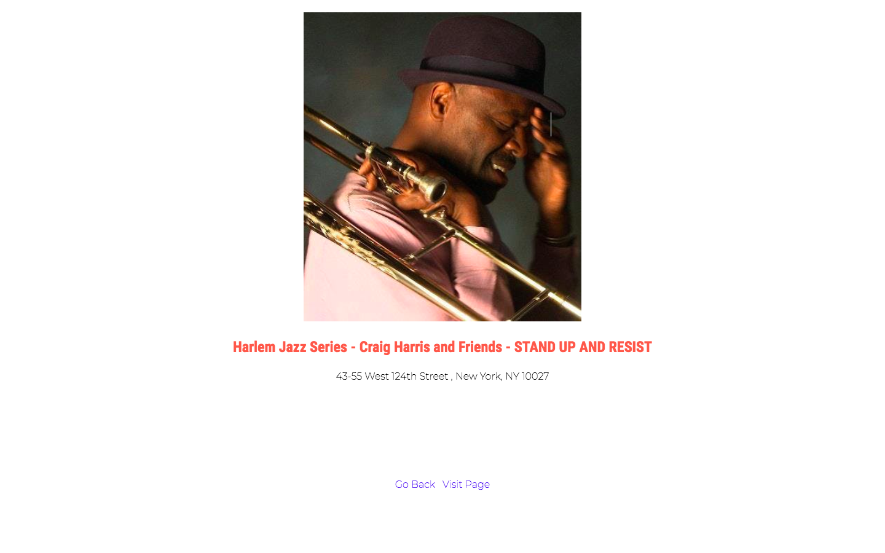
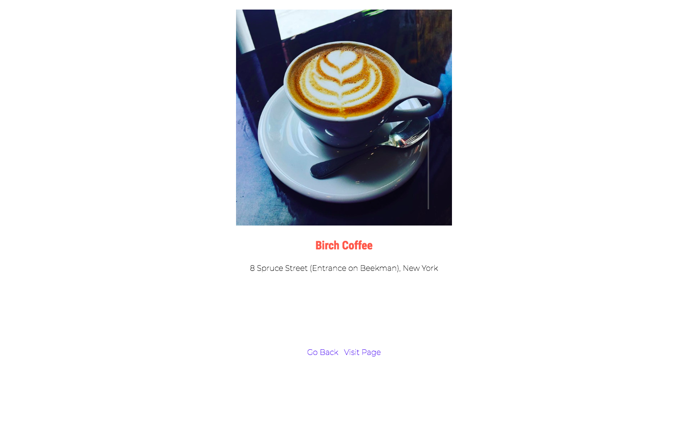

## Stack

#### Frontend

* HTML
* CSS
* JavaScript

##### APIs:
* Eventbrite
* Foursquare
* Darksky
* IPstack

#### Responsiveness

## Roadmap

#### Version 1.1
* Include update/edit button to edit list
* Use a database instead of localStorage to store the list
* Link the events/places of interest to the list

#### Version 1.2
* Add focus trap in the modals for the events/places/planner lightboxes to keep track of keyboard focus
* Put focus on the lightbox when it opens and focus again on previous item when lightbox is closed
* Add Lyft API so so that users can schedule a ride
* Add login feature so that users can save their data
* More security to protect keys, using Node, databse, and frontend framework

User Feedback

[User feedback](https://gist.github.com/azureowl/0e64cb70994a0b3ed2c33badea167d8d)