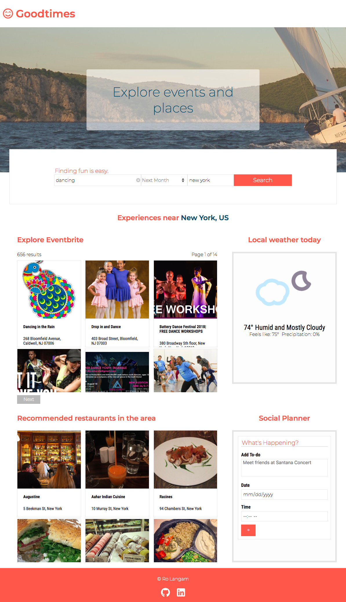
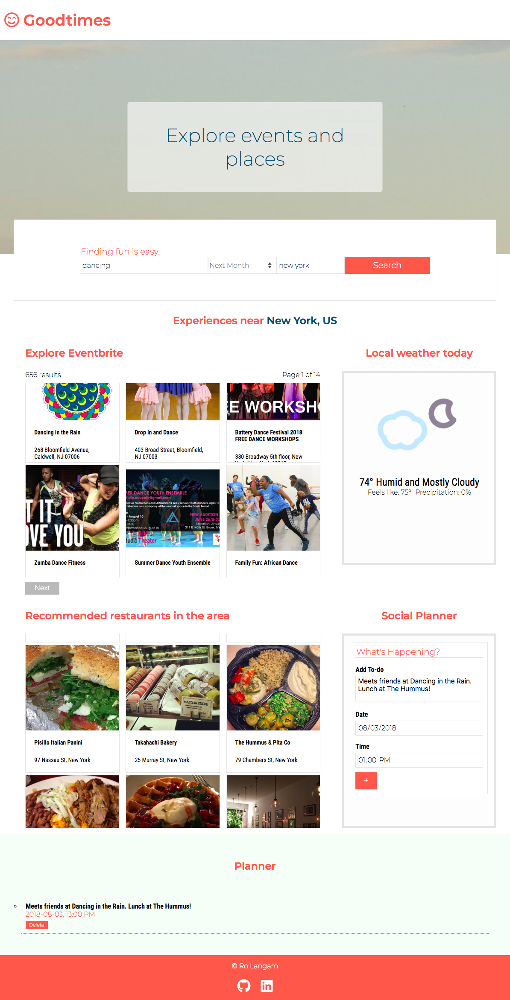
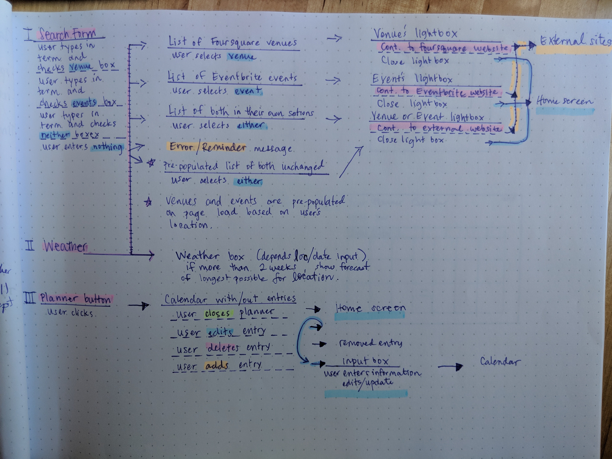
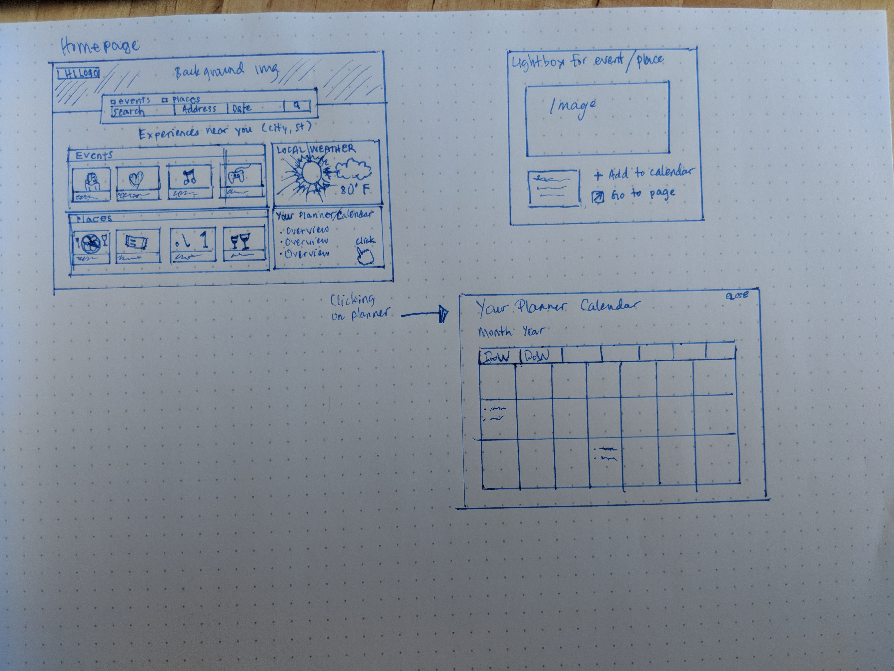

## Goodtimes
***
Goodtimes is a combination of an event finder and planner all in one dashboard.
***
### Inspiration
<blockquote>Preparing for an event would be easier if I can find an event to attend, plan a ride, pick a restaurant, get an idea of the current weather (because San Francisco can be cold and windy on a summer day), and save it to a list or calender all in one view! -Me </blockquote>

That's how I felt a few weekends ago.

Goodtimes aims to be a one-stop event finder and social planner. The dashboard allows users to plan a hangout around an event in a specific location which includes 10 recommended restaurants for that destination so planning is simplified. Local weather data for the current day is helpful in reminding users on what is the most weather-appropriate attire. The social planner saves a user's notes in localStorage so it will always be there until they clear their browser's history.

After starting, begin your search! Simply type in an event that interests you. Goodtimes uses Eventbrite, Foursquare, and Darksky APIs.

Goodtimes is my API Capstone Project for Thinkful.

***
Current version
v1.0

***

## Roadmap
Because I feel very passionate about this app and hope to share it with my friends when it's fully completed, I plan to add more features as I progress through the program.

#### Version 1.1
* Include update/edit button to edit list
* Use a database instead of localStorage to store the list
* Link/add from the events/places of interest to the list

#### Version 1.2
* Add back modals with focus on accessibility
* Add Lyft API so so that users can schedule a ride
* Add login feature so that users can save their data
* More security to protect keys, using Node, databse, and frontend framework

***

***

Try it out:
[Live version](https://azureowl.github.io/good-times-eventbrite-foursquare-ipstack-darksky-capstone/)

caveat: Foursquare quota limits for free accounts are very small  :)

***

## Parts of the user flow:
* Search form
* Eventbrite section
* Foursquare section
* Weather section
* Planner section
* Clicking on Eventbrite and Foursquare results will bring user to Foursquare/Eventbrite pages

## User Stories:
* As a user, I want to be able to find a place or event to visit so that I can make reservations or attend an event.
* As a user, I should be able to narrow my search so I can decide on a specific experience, date range, and location
* As a user, I should be aware of the weather so I can dress for the occasion at the place or event.
* As a user, I should be able to add what I've planned in my planner/todo list so that I can see where I'm going to go, where I've been, where I desire to go and the date and time.
* As a user, I should be able to edit and delete what I added in my planner/todo list so that I can keep my list relevant. (for next version)
* As a user, I should be able to get a summary of the event or place so that I can make a better decision if the event or place is of interest and is achievable. (for next version)
* As a user, I should be able to go to the homepage on either Eventbrite or Foursquare for the particular selection so that I can get more details.
* As a user, I should be able to tab and select events or places with a keyboard so that I feel the website is accessible to me.

## Stack

#### Frontend

* HTML
* CSS
* JavaScript
* jQuery

##### APIs:
* Eventbrite
* Foursquare
* Darksky
* IPstack (temporarily disabled; HTTPS is unsupported in free plans)

#### Responsiveness
* Mobile/desktop
* Chrome/Firefox/Safari

***

User Feedback

[User feedback](https://gist.github.com/azureowl/0e64cb70994a0b3ed2c33badea167d8d)